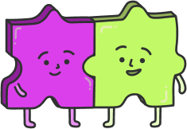

<div align="center">
   
   
   
   
   <h1 style="margin-top: 20px;">HackSC Official UI Kit 🌺</h1>
</div>

<div align="center">

</div>
<br />

The official UI kit for HackSC! This is where we store most of our main theme kit that was bootstrapped in 2023.

## Installation

```
# NPM
npm install @hacksc/ui-kit

# Yarn
yarn add @hacksc/ui-kit
```

## Usage

```
import { Button } from "@hacksc/ui-kit"

function Example() {
  return <Button color="blue">Submit to HackSC 2024!</Button>
}
```

## Development

Here are some available scripts:

### `npm test`

Run tests on the UI kit (E2E + React tests)

### `npm run build`

Builds the UI kit for production to the `build` folder. It correctly bundles React in production mode and optimizes the build for the best performance.

The build is minified and the filenames include the hashes.
